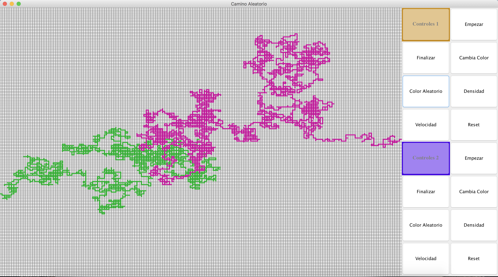

# Camino Aleatorio / Random Walk - Markov

   La caminata aleatoria o paseo aleatorio o camino aleatorio, abreviado en inglés como RW (Random Walks), es una formalización matemática de la trayectoria que resulta de hacer sucesivos pasos aleatorios. Por ejemplo, la ruta trazada por una molécula mientras viaja por un líquido o un gas, el camino que sigue un animal en su búsqueda de comida, el precio de una acción fluctuante y la situación financiera de un jugador pueden tratarse como una caminata aleatoria. [Fuente Wikipedia](https://es.wikipedia.org/wiki/Camino_aleatorio).

   

## [Guía para visualizar la Applet](https://github.com/AntonioGarnier/Applets)

## [Enlace a la gh-pages](https://antoniogarnier.github.io/Random-Walk_Markov/)
